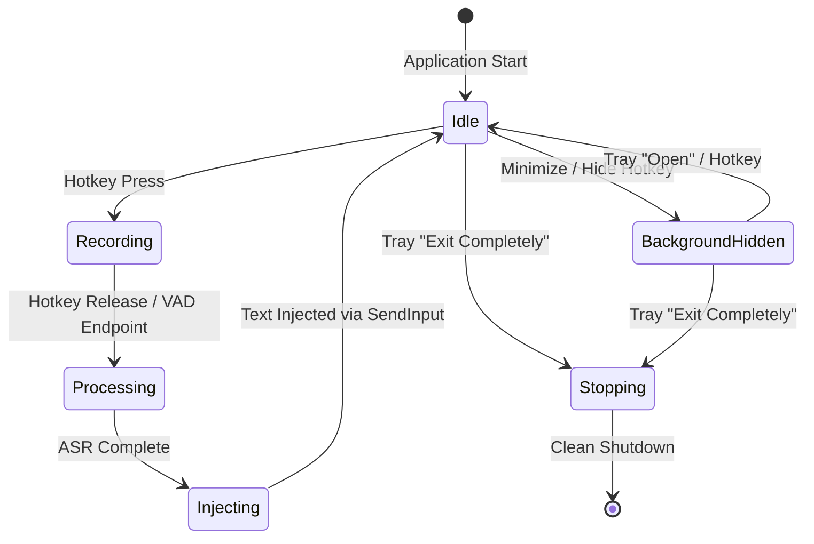

# OmniType Rust UI Skill

Use this skill when designing, reviewing, or implementing the desktop UI for **OmniType FreePTT v2** — an offline-first Windows push-to-talk voice typing application built in Rust with `egui` and `eframe`.

---

## 1. Project Technology Stack & Architecture

> [!IMPORTANT]
> The OmniType FreePTT v2 UI is strictly built on **`egui 0.28` / `eframe 0.28`** with native Windows platform integrations.
> Do **not** propose or introduce alternative GUI frameworks (such as Slint, Iced, Relm4, or GTK) without an approved Architecture Decision Record (ADR).

### Core UI Components & File Locations

- **Main UI & Overlay**: [`voice-ptt/src/gui/overlay.rs`](file:///c:/Users/LENOVO%20LOQ/tools/OmniType-FreePTT/v-2/voice-ptt/src/gui/overlay.rs)
  - Manages the floating status capsule, manager views, and theme visuals.
  - Implements `eframe::App` for the primary overlay window.
- **Color Palette & Theme Engine**: `mod palette` inside [`overlay.rs`](file:///c:/Users/LENOVO%20LOQ/tools/OmniType-FreePTT/v-2/voice-ptt/src/gui/overlay.rs)
  - Supports dual themes: Dark (default) and Light (`#[cfg(feature = "light-theme")]`).
  - Strict Rule: **No literal `Color32::from_rgb` calls outside `mod palette`**. All UI elements must reference semantic color tokens.
- **Shared Chrome Helpers**:
  - `manager_central_panel`: Standard frame and margins for manager windows.
  - `manager_card(fill, stroke)`: Content card container (8px rounding, 1px stroke, 10px margin).
  - `status_chip(ui, text, bg, color, size, ChipFamily)`: Unified status chips (Small/Tiny) with Persian shaping.
  - `capsule_frame(fill, stroke, rounding, margin)`: Capsule frame for Idle, Recording, Processing, and Error states.
  - `header_badge`: Consistent header icons and title badges.
- **Toast Notifications**:
  - Vendored [`third_party/egui-notify`](file:///c:/Users/LENOVO%20LOQ/tools/OmniType-FreePTT/v-2/third_party/egui-notify) (0.15 with custom width-cap patch).
  - Capped with `TOAST_MAX_WIDTH = 320.0` and adaptive height; unspaced Persian/code tokens are wrapped cleanly.
- **System Tray Integration**: [`voice-ptt/src/gui/tray.rs`](file:///c:/Users/LENOVO%20LOQ/tools/OmniType-FreePTT/v-2/voice-ptt/src/gui/tray.rs)
  - Runs in background with atomic flags: `overlay_flag`, `dict_flag`, `engine_flag`, `history_flag`, `quit_flag`.
- **Data Paths (exe-first)**: [`voice-ptt/src/paths.rs`](file:///c:/Users/LENOVO%20LOQ/tools/OmniType-FreePTT/v-2/voice-ptt/src/paths.rs)
  - Priority: `Exe Directory -> Current Working Directory -> %APPDATA%\voice-ptt`.

---

## 2. Non-Negotiable Preview-First Gate

Before modifying or implementing UI code for any new window, layout, interaction, or theme change:

1. **Inspect Existing UI**: Identify the affected flow and existing reusable helpers in [`overlay.rs`](file:///c:/Users/LENOVO%20LOQ/tools/OmniType-FreePTT/v-2/voice-ptt/src/gui/overlay.rs).
2. **Prepare Design Options**:
   - Substantial change: Prepare at least **two compact design options**.
   - Small change/bug fix: Prepare at least **one concrete mockup**.
3. **Present in an Antigravity Artifact**:
   - Create a markdown artifact (or use generative UI) in `<appDataDir>\brain\<conversation-id>/`.
   - Include visual wireframes (ASCII, markdown tables, or diagrams), interaction flows, semantic tokens used, and design trade-offs.
4. **Halt and Await User Approval**:
   - Stop before writing code.
   - Do not assume silence or vague requests as design approval. Wait for explicit user confirmation.

---

## 3. Mandatory In-App Views (Fixing IDE Launch Defect)

> [!WARNING]
> Selecting settings or dictionary management must **never** launch external IDEs or text editors like VS Code.
> All routine configuration and dictionary editing must occur within dedicated in-app `egui` windows.

### Settings Window (`config.toml`)
- Resolve path via `paths::resolve_config_path()`.
- Expose typed controls:
  - Hotkey selection and toggle behavior.
  - Active ASR engine priority (Google Free Speech, Cloud Groq/OpenAI, Local Whisper).
  - VAD sensitivity threshold and silence timeout.
  - Sound cues and toast notification preferences.
- Validate on input; write atomically to disk; detect external changes and offer reload.

### Dictionary Manager (`dictionary.toml`)
- Resolve path via `paths::resolve_dictionary_path()`.
- Display entries as a searchable, scrollable table/list:
  - Columns: Pattern / Mishearing, Replacement / Correct term, Scope.
  - Inline actions: Add new rule, Edit entry, Delete rule, Reload from disk.
- Persian text search input with RTL cursor support.
- Protect against saving duplicate or cyclic rules.

### Engine Status & Quota View
- Display real-time availability of local Whisper (model path, loaded status, memory consumption).
- Display cloud engine quotas, reset times, and API key status (safely masked, e.g. `gsk_...3a1f`).
- Provide manual "Check engine health" and "Hot-reload local model" controls.

---

## 4. Window, Tray, and Process Lifecycle

The UI and application lifecycle must strictly distinguish between **Hide to Background** and **Full Exit**:



### 1. Single-Instance Guard
- Guarded by named mutex `Local\OmniTypeFreePTT.SingleInstance`.
- Second launch displays a native Windows MessageBox notification and terminates gracefully.

### 2. Hide to Background (`BackgroundHidden`)
- Triggered by window close button, escape key, or configured hide hotkey.
- Hides the GUI window; audio capture, hotkey listener, and system tray remain fully active.
- Tooltip in notification area: `"OmniType FreePTT — Running in background"`.

### 3. Restore Window
- Clicking tray icon or selecting `"Open OmniType"` un-minimizes and focuses the single existing window.

### 4. Full Exit (`Stopping -> Exited`)
- Triggered exclusively by `"Exit completely"` in the system tray menu.
- Must execute complete cleanup:
  - Deregister Windows low-level keyboard hooks.
  - Stop WASAPI audio capture streams.
  - Abort or await in-flight Whisper/cloud inference.
  - Flush logs and persist dictionary/settings.
  - Remove system tray icon from Windows notification area.
  - Terminate the process cleanly (`exit code 0`).

---

## 5. Persian Typography, RTL & Accessibility Contract

OmniType FreePTT is designed primarily for Persian speech transcription with embedded Latin technical tokens:

- **Font Configuration**: Ensure `eframe` loads fonts supporting Arabic/Persian Unicode blocks (`0x0600..=0x06FF`, `0xFB50..=0xFDFF`, `0xFE70..=0xFEFF`).
- **ZWNJ Integrity**: Never strip or corrupt Zero-Width Non-Joiner characters (`\u{200c}`) used in Persian prefixes/suffixes (`می‌شود`, `خانه‌ها`).
- **Mixed-Direction Text**: Verify that combined Persian-English strings (e.g., `تابع print را اجرا کن`) render without flipped punctuation or displaced numbers.
- **Keyboard Navigation**: All interactive buttons, tabs, and list items must be accessible via `Tab` / `Shift+Tab` and activated with `Space` or `Enter`.
- **WCAG Contrast**: Adhere to contrast thresholds detailed in [`docs/light-theme-tuning.md`](file:///c:/Users/LENOVO%20LOQ/tools/OmniType-FreePTT/v-2/docs/light-theme-tuning.md).

---

## 6. Required UI States (Preview Matrix)

Before finalizing any UI feature, verify all 10 states:

| # | State | Visual Indicator / Representation |
|---|---|---|
| 1 | **First Run (No Model)** | Status badge "No Model Loaded", clear prompt to download or select cloud. |
| 2 | **Idle / Ready** | Compact status capsule, mic ready, current engine indicator (e.g. "Whisper Base"). |
| 3 | **Recording** | Active pulsing recording badge (`RECORDING` color), live audio waveform or meter. |
| 4 | **Processing** | Animated processing indicator (`PROCESSING` color), ASR worker busy. |
| 5 | **Cloud Consent** | Explicit opt-in prompt before sending audio to external APIs. |
| 6 | **Recoverable Error** | Toast notification or card banner (`WARNING` / `ERROR` color) with actionable retry. |
| 7 | **Background Hidden** | Window invisible, tray icon visible with context menu ready. |
| 8 | **Tray Menu** | "Open OmniType", "Active Engine", "Dictionary", "Settings", "Exit completely". |
| 9 | **Settings Validation** | Inline red error text on invalid paths or port collisions; save button disabled. |
| 10 | **Dictionary Search/Edit** | Search filter bar, populated rows, inline editing fields, and unsaved changes cue. |

---

## 7. Verification & Quality Commands

Always verify changes using the repository's standard commands:

```powershell
# In directory: voice-ptt
cargo check --all-targets                            # Dark theme validation
cargo check --all-targets --features light-theme     # Light theme validation
cargo clippy --all-targets                           # Strict standard: 0 warnings
cargo test --lib                                     # Run full unit & integration suite
```
