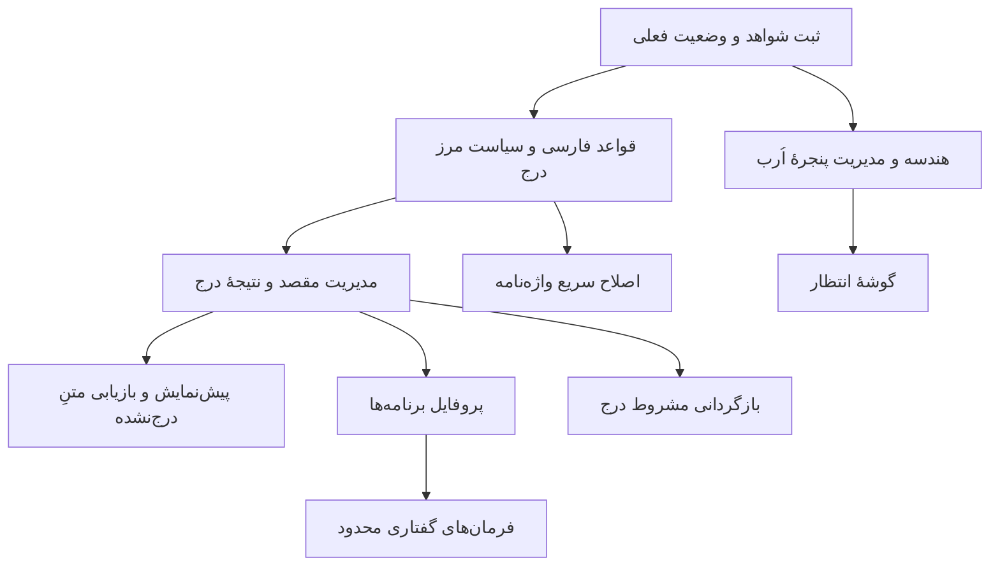

# رودمپ توسعهٔ محصول OmniType

> وضعیت پس از ممیزی ۲۰۲۶-۱۰-۰۷: تحویل بسته‌های پیاده‌سازی به معنی پذیرش نهایی محصول نیست. چهار اصلاح کدی و سه مسیر راستی‌آزمایی در [رودمپ اصلاحی](REMEDIATION-ROADMAP-2026-10-07.md) ثبت شده‌اند. مبنای اجرای بعدی [پرامپت کامل اصلاحات](REMEDIATION-EXECUTION-PROMPT.md) است؛ این اسناد هنوز گزارش اجرای اصلاحات نیستند.

تاریخ: ۲۰۲۶-۱۰-۰۱ · وضعیت: پیشنهاد برای برنامه‌ریزی، نه اعلام تکمیل قابلیت‌ها

## هدف و محدوده

هدف پیشنهادی محصول، «تایپ صوتی فارسیِ قابل‌اعتماد با کمترین مزاحمت روی صفحه» است. این سند پیشنهادهای قابلیت و اصلاح ساختار را به مراحل قابل‌تحویل تبدیل می‌کند. ایجاد این سند به معنی شروع پیاده‌سازی، تغییر تنظیمات، نصب یا انتشار نیست.

اولویت‌ها بر اساس مشکلات مطرح‌شده توسط کاربر و بررسی کد پروژه‌اند؛ پژوهش بازار، تخمین قطعی زمان یا تأیید عملکرد نسخهٔ نصب‌شده انجام نشده است. پیش از هر مرحله، وضعیت همان روز کد باید بررسی شود؛ تغییرات هم‌زمان در پوشهٔ کاری می‌توانند بعضی از مسائل قبلی را برطرف کرده باشند.

> [!IMPORTANT]
> هالهٔ سفید یک مسئلهٔ باز با نیاز به شاهد اجرایی است. وجود پنجرهٔ شفاف یا یافتن نقص در مدیریت آن، به‌تنهایی علت پیکسل‌های سفید را اثبات نمی‌کند. کوچک‌شدن پنجره نیز معادل رفع هاله نیست.

## ۱. اصول تصمیم‌گیری

- حفظ متن کاربر بر سرعت یا زیبایی اولویت دارد؛ حذف خودکار متن و درج در مقصد نامعلوم باید محدود شوند.
- قواعد فارسی باید محافظه‌کارانه باشند و کلمات سالم را با قواعد عمومی نشکنند.
- هر قابلیت باید رفتار روشن در خطا، لغو، تغییر برنامهٔ فعال و شروع جلسهٔ جدید داشته باشد.
- اصلاح ساختار در کنار نیاز واقعی انجام شود؛ بازنویسی کامل یا تفکیک صرفاً برای کم‌کردن تعداد خطوط پیشنهاد نمی‌شود.
- قابلیت‌های موجود مثل واژه‌نامه، تاریخچه، ضبط با دوبار فشار و مسیر موتور محلی، ابتدا تکمیل شوند؛ وجود کد با تأیید عملکرد محصول یکسان نیست.
- **دوبار زدن میان‌بر یک قابلیت موجود است، نه پیشنهاد:** قاعدهٔ «ضبط آزاد» با `double_tap_latch` و `tap_max_ms` در تنظیمات و با `LatchPolicy` در [session.rs](../../voice-ptt/src/state/session.rs) پیاده و آزموده شده است. کارِ باقی‌مانده تکمیل و آزمون آن روی صفحه است، نه طراحی دوباره‌اش.
- هر مرحله با معیار خروج پایان می‌یابد؛ زمان‌بندی تقویمی پس از تعیین ظرفیت تیم و بررسی وابستگی‌ها انجام می‌شود.

## ۲. نقشهٔ مراحل و وابستگی‌ها

| مرحله | هدف | تحویل اصلی | شرط عبور |
|---|---|---|---|
| ۰ | ثبت وضعیت قابل‌تکرار | نمونه‌های خطا، نسخهٔ اجرا و سناریوهای پایه | مسئله‌ها قابل‌بازتولید و شواهد قابل‌ردیابی باشند |
| ۱ | تثبیت متن و اُرب | اصلاح فارسی، مرز درج، هندسه و تعامل پنجره | متن سالم حفظ شود؛ کلیک و حرکت اُرب قابل‌اعتماد باشند |
| ۲ | کنترل و اطمینان کاربر | مقصد تایپ، پیش‌نمایش، گوشهٔ انتظار، بازیابی متنِ درج‌نشده | متن در تغییر تمرکز یا شکست درج از دست نرود |
| ۳ | سرعت استفادهٔ روزمره | پروفایل برنامه، واژه‌نامهٔ سریع، فرمان‌های محدود | رفتار قابل‌پیش‌بینی با تنظیمات روشن |
| ۴ | تکمیل و آماده‌سازی انتشار | آزمون میکروفون، ذخیرهٔ امن کلیدها، بازگردانی مشروط | سناریوهای خطا و مهاجرت تنظیمات بررسی شده باشند |

امن‌سازی کلیدها می‌تواند زودتر انجام شود؛ به‌ویژه قبل از افزودن خروجی تنظیمات یا بستهٔ عیب‌یابی. آزمون میکروفون نیز در صورت زیادبودن مشکلات ورودی صدا، قابل‌انتقال به مرحلهٔ ۲ است.

## ۳. مرحلهٔ صفر: خط مبنا

برای هر مسئله، نسخه و مسیر فایل اجرایی، وضعیت تنظیمات مرتبط، مراحل بازتولید، نتیجهٔ مورد انتظار و نتیجهٔ واقعی ثبت شود. دادهٔ حساس مثل متن شخصی یا کلید سرویس وارد گزارش عمومی نشود.

برای اُرب، آماده‌باش، ضبط، پردازش، پایان، خطا، اشاره‌گر روی اُرب، کشیدن، تغییر مقیاس نمایش و بازیابی موقعیت بررسی شوند. برای متن، ورودی خام موتور و خروجی هر مرحله با نمونهٔ مجاز یا ساختگی مقایسه شوند تا خطای موتور با خطای اصلاح‌کننده مخلوط نشود.

**معیار خروج:** نمونه‌ای قابل‌تکرار برای نیم‌فاصلهٔ غلط، چسبیدن متن، فاصله تا لبه و هاله تهیه شود؛ برای موردی که بازتولید نمی‌شود، وضعیت «تأییدنشده» ثبت شود. تست محاسباتی جای بررسی بصری را نمی‌گیرد.

## ۴. مرحلهٔ اول: تثبیت تجربهٔ اصلی

### ۴.۱. اصلاح فارسی قابل‌انتخاب

**مسئله:** کاربر باید بتواند خروجی موتور را از تغییرات پس‌پردازش جدا کند. درج نیم‌فاصله صرفاً بر اساس ابتدا یا انتهای کلمه می‌تواند واژهٔ سالم را خراب کند.

**رفتار پیشنهادی:**

- «خام»: متن شناخته‌شده بدون اصلاح نگارشی و واژه‌نامه؛ سیاست مرز درج مستقل باقی می‌ماند.
- «محافظه‌کارانه»: اصلاح نویسه‌های عربی به فارسی، فاصله‌های تکراری و قواعد کم‌ابهام؛ نیم‌فاصله تنها در الگوهای معتبر.
- «رسمی»: قواعد نگارشی گسترده‌تر و نشانه‌گذاری، با امکان خاموش‌کردن هر گروه. این حالت در نسخهٔ نخست به معنی بازنویسی معنایی با هوش مصنوعی نیست.

نوع اعداد، نیم‌فاصله، نشانه‌گذاری و واژه‌نامه تنظیمات مستقل داشته باشند. پیش‌نمایش تنظیمات با یک جملهٔ ثابت نشان دهد هر گزینه چه تغییری ایجاد می‌کند. فهرست استثناها به‌تنهایی جای قواعد معتبر را نگیرد.

**نسخهٔ نخست:** خام و محافظه‌کارانه، تنظیم اعداد و روشن/خاموش‌کردن واژه‌نامه. حالت رسمی پس از اعتبارسنجی قواعد اضافه شود.

**معیار پذیرش:** نمونه‌هایی مثل «کلمات»، «تمام» و «میکروفون» شکسته نشوند؛ نمونه‌های صحیح نیم‌فاصله حفظ شوند؛ اعمال دوبارهٔ اصلاح نتیجه را تغییر ندهد؛ خام واقعاً از مسیر اصلاح و واژه‌نامه عبور نکند.

### ۴.۲. سیاست فاصله در مرز درج

**مسئله:** فاصلهٔ بین کلمات داخل یک قطعه، با فاصلهٔ بین دو عملیات درج متفاوت است. افزودن کورکورانهٔ فاصله در همهٔ حالت‌ها هم قبل از نشانه‌گذاری یا در ابتدای خط غلط است.

**رفتار پیشنهادی:** یک سیاست مشترک مشخص کند هنگام ادامهٔ متن، شروع خط، نشانه‌گذاری و جایگزینی انتهای قطعه چه جداکننده‌ای لازم است. در نسخهٔ نخست، ادامهٔ قطعه‌ها در همان مقصدِ تأییدشده یک فاصلهٔ معمولی داشته باشد؛ دستور خط جدید و ترمیم واژه استثناهای صریح باشند.

وقتی برنامه به متن اطراف مکان‌نما دسترسی معتبر ندارد، این محدودیت پنهان نشود. از حافظهٔ آخرین متن برنامه نمی‌توان وضعیت واقعی سند را پس از ویرایش دستی استنتاج کرد.

**معیار پذیرش:** دو قطعه به هم نچسبند؛ نشانه‌گذاری و خط جدید فاصلهٔ اضافه نگیرند؛ بعد از تغییر مقصد، حافظهٔ ادامهٔ متن و ترمیم انتها قابل‌استفاده نباشد؛ قطعهٔ خالی چیزی درج نکند.

### ۴.۳. هندسه، اندازه و تعامل اُرب

**رفتار پیشنهادی:** اندازهٔ پنجره از بیشینهٔ واقعی رسم استخراج شود. بوم ثابتِ کوچک‌تر در قدم اول بررسی شود؛ تغییر اندازه در هر فریم بدون شواهد اجرایی انتخاب نشود. ظاهر، درخشش و انیمیشن برای جاگرفتن در پنجره حذف یا کوچک نشوند.

شعاع بدنه، محدودهٔ رسم، محدودهٔ تعامل و حاشیهٔ لبه چهار مفهوم جدا هستند. حرکت بر اساس لبهٔ دیداری و محدودهٔ قابل‌استفادهٔ نمایشگر محدود شود. اگر بزرگ‌شدن در نزدیکی لبه نیازمند جابه‌جایی است، جابه‌جایی حداقلی باشد و جای انتظار کاربر بی‌دلیل تغییر نکند.

**جزئیات فنی:** تبدیل پیکسل و واحد رابط یکپارچه شود؛ موقعیت ذخیره‌شده با کشیدن سازگار باشد؛ تعویض نمایشگر و قطع آن، پنجره را خارج از دسترس نگذارد؛ حافظهٔ هندسه تنها هنگام تغییر واقعی شناسهٔ پنجره یا نامعتبرشدن آن پاک شود. محدودهٔ کلیک نباید با قطع درخشش کوچک شود.

**معیار پذیرش:** در همهٔ حالت‌ها بریدگی دیده نشود؛ فضای خارج از تعامل کلیک زیرین را نگیرد؛ حرکت کنار لبه و نوار وظیفه قابل‌توضیح باشد؛ اندازهٔ قبل و بعد ثبت شود. برای هاله، نتیجهٔ بررسی بصری مستقل و با شرایط بازتولید گزارش شود.

## ۵. مرحلهٔ دوم: کنترل و حفظ متن

### ۵.۱. حفظ مقصد تایپ

**مسئله:** بین شروع ضبط و آماده‌شدن متن، کاربر ممکن است به برنامه یا کادر دیگری برود. شناسهٔ پنجره به‌تنهایی همیشه هویت کادر متن را مشخص نمی‌کند.

**رفتار پیشنهادی:** مقصد در شروع جلسه ثبت شود و پیش از هر درج دوباره بررسی شود. اگر مقصد تغییر کرده یا اعتبار آن نامعلوم است، متن در حالت «آمادهٔ درج» نگه داشته شود. کاربر بتواند مقصد جدید را انتخاب کند، کپی کند یا عملیات را لغو کند. برنامه خودکار تمرکز را از کاربر نگیرد.

**نسخهٔ نخست:** تشخیص تغییر برنامه/پنجره و توقف درج؛ تشخیص دقیق کادرهای قابل‌پشتیبانی در مرحلهٔ بعد. محدودیت تشخیص کادر با تغییر داخل همان پنجره صریح باشد.

**معیار پذیرش:** جابه‌جایی به برنامهٔ دیگر باعث تایپ ناخواسته نشود؛ بسته‌شدن مقصد متن را حذف نکند؛ خروجی دیررسِ جلسهٔ لغوشده درج نشود؛ تغییر مقصد، ترمیم انتهای متن قبلی را غیرفعال کند.

### ۵.۲. پیش‌نمایش و تأیید اختیاری

**رفتار پیشنهادی:** کاربر میان تایپ مستقیم و «بازبینی پیش از درج» انتخاب کند. در بازبینی، متن نهایی قابل‌ویرایش باشد و اقدامات درج، کپی و لغو داشته باشد. صرف بازشدن پیش‌نمایش نباید مقصد اصلی را فراموش کند.

در ضبط طولانی، رفتار مشخص لازم است: نسخهٔ نخست یک پیش‌نویس برای کل جلسه جمع کند و بعد از پایان تأیید بگیرد؛ درج قطعه‌به‌قطعه با تأیید، قابلیت بعدی است. متن موقت موتور با متن نهایی اشتباه نمایش داده نشود.

**معیار پذیرش:** پیش از تأیید چیزی درج نشود؛ یک تأیید فقط یک بار درج کند؛ تغییرات دستی کاربر حفظ شوند؛ شکست درج پیش‌نویس را باقی بگذارد؛ حالت مستقیم همچنان قابل‌استفاده باشد.

### ۵.۳. گوشهٔ انتظار و بازگشت پس از بی‌کاری

**رفتار پیشنهادی:** گزینهٔ خاموش/روشن، زمان انتظار و گوشهٔ مقصد فراهم شود. مقدار پیشنهادی اولیه ۶۰ ثانیه است، نه الزام نهایی. زمان بی‌کاری پس از پایان ضبط و پردازش آغاز شود؛ کشیدن یا تعامل زمان را از نو شروع کند.

کاربر بتواند محل فعلی را ثابت کند یا به محل انتظار برگرداند. نمایشگر انتظار مشخص باشد؛ در قطع نمایشگر، مقصد به نمایشگر قابل‌دسترسی منتقل شود. حرکت نرم، کوتاه و قابل‌خاموش‌کردن باشد.

**معیار پذیرش:** هنگام ضبط، پردازش، کشیدن یا پیش‌نمایشِ نیازمند اقدام حرکت خودکار رخ ندهد؛ بازگشت فقط یک بار برای هر دورهٔ بی‌کاری انجام شود؛ موقعیت دستی و مقصد انتظار دو مقدار مستقل باشند.

### ۵.۴. بازیابی متنِ درج‌نشده

**تصمیم قطعی (۲۰۲۶-۱۰-۰۱): واحد بازیابی فقط متن است، نه صدا.** بازیابی یعنی
متنی که تبدیلش **موفق** بوده ولی **درجش شکست خورده** است. در این نسخه هیچ پیشنهادی برای
تلاش مجددِ تبدیل، نگه‌داری صدا، ذخیرهٔ صوت روی دیسک یا انتخاب موتور دیگر وجود ندارد و
ساخته نمی‌شود؛ این‌ها باطل‌اند، نه به تعویق‌افتاده.

**رفتار پیشنهادی:** پس از شکست درج، کاربر بتواند همان متنِ آماده را یک بار دیگر
بفرستد، آن را کپی کند یا کنار بگذارد. تلاش مجدد فقط **درج** را تکرار می‌کند، هرگز تبدیل را.

اگر خودِ **تبدیل** شکست خورده باشد، چیزی برای بازیابی وجود ندارد: کاربر باید دوباره صحبت
کند و این باید در رابط گفته شود، نه اینکه پنهان بماند.

**بافر موقت با بافر بازیابی یکی نیست.** بافر صوتیِ همان ضبط و تبدیلِ جاری لازم است و با
پایان همان عملیات کنار می‌رود؛ آن بافر، نه آرشیو صوتی است و نه بافر بازیابی، و نباید
فراتر از همان فراخوانی زنده بماند. بازیابی روی **متن** کار می‌کند، پیش‌فرض **در حافظه**.

در جلسهٔ چندقطعه‌ای، فقط قطعهٔ درج‌نشده دوباره فرستاده شود. تلاش مجدد نباید قطعه‌های
درج‌شده را تکرار کند و درجِ ناقص خودکار تکرار نشود، چون متن تکراری می‌سازد.

**معیار پذیرش:** تلاش مجدد متن تکراری نسازد؛ ترتیب قطعه‌ها حفظ شود؛ لغو، پاسخ دیررس را
بی‌اثر کند؛ انقضا با ساعت قابل‌آزمون باشد؛ و پس از پایان هر تبدیل، هیچ صوتی باقی نمانده باشد.

## ۶. مرحلهٔ سوم: سرعت و شخصی‌سازی

### ۶.۱. اصلاح واژه با یک اقدام

واژه‌نامه موجود است؛ هدف، کوتاه‌کردن مسیر استفاده از آن است. کاربر از تاریخچه یا پیش‌نمایش عبارت اشتباه را انتخاب کند، جایگزین بنویسد و اثر قاعده را قبل از ذخیره ببیند.

نسخهٔ نخست جایگزینی دقیقِ کلمه یا عبارت داشته باشد؛ تطبیق مبهم خودکار و یادگیری بی‌اجازه انجام نشود. تعارض با قاعدهٔ قبلی، محدودهٔ عمومی یا پروفایل و امکان حذف قاعده روشن باشند.

**معیار پذیرش:** اصلاح یک واژه به زیررشتهٔ داخل واژه‌های دیگر آسیب نزند؛ قواعد متعارض توضیح داده شوند؛ افزودن و حذف در خروجی بعدی اثر کند؛ تاریخچهٔ قبلی خودکار بازنویسی نشود.

### ۶.۲. پروفایل برنامه‌ها

**رفتار پیشنهادی:** پروفایل عمومی و پروفایل اختیاری برای برنامه‌ها فراهم شود. هر پروفایل بتواند زبان، حالت اصلاح، نوع اعداد، واژه‌نامه و شیوهٔ درج را تعیین کند. مثال: پیام‌رسان با متن محاوره‌ای و Word با قواعد رسمی.

هویت برنامه با مسیر یا شناسهٔ معتبر تشخیص داده شود؛ عنوان پنجره به‌تنهایی کافی نیست. پروفایل در شروع جلسه تثبیت شود تا تعویض برنامه وسط ضبط قواعد قطعه‌های همان جلسه را عوض نکند. انتخاب پروفایل و مقصد درج، دو تصمیم مستقل باشند.

**نسخهٔ نخست:** چند پروفایل دستی و اتصال به برنامهٔ اجرایی. تشخیص سایت‌های داخل مرورگر و قواعد مبتنی بر عنوان به بعد موکول شوند.

**معیار پذیرش:** برنامهٔ بدون پروفایل از عمومی استفاده کند؛ تغییر پروفایل وسط جلسه خروجی ناسازگار نسازد؛ تنظیمات اختصاصی بدون پاک‌کردن عمومی قابل‌حذف باشند؛ نشان کوچکی پروفایل فعال را توضیح دهد.

### ۶.۳. فرمان‌های گفتاری محدود

با «خط جدید»، «پاراگراف جدید» و نشانه‌گذاری شروع شود. حالت فرمان جدا یا عبارت آغازگر مشخص داشته باشد تا گفتن نام فرمان در یک جمله، عملیات ناخواسته اجرا نکند. ترتیب فرمان و متن در قطعه‌ها حفظ شود.

نسخهٔ نخست شامل حذف متن، ارسال پیام، اجرای برنامه یا فرمان سیستم نباشد. «این کلمه را حذف کن» نیازمند شناخت محدودهٔ معتبر متن است و به بخش بازگردانی وابسته است.

**معیار پذیرش:** در حالت عادی، جملهٔ حاوی «خط جدید» قابل‌تایپ باشد؛ در حالت فرمان فقط فرمان معتبر اجرا شود؛ فرمان نامفهوم عملیات انجام ندهد؛ خط جدید باعث قطع ناخواستهٔ ضبط نشود.

## ۷. مرحلهٔ چهارم: تکمیل تجربه و آمادگی انتشار

### ۷.۱. آزمون سادهٔ میکروفون

ضبط آزمایشی کوتاه با انتخاب دستگاه، نمایش سطح ورودی و پخش اختیاری فراهم شود. نبود ورودی، سطح کم و اشباع از دادهٔ اندازه‌گیری‌شده تشخیص داده شوند. این آزمون نباید علت‌هایی مثل «خرابی میکروفون» را صرفاً از سکوت نتیجه بگیرد.

**معیار پذیرش:** دستگاه واقعی انتخاب‌شده مشخص باشد؛ حذف دستگاه خطای قابل‌فهم بدهد؛ بستن آزمون منابع صوتی را آزاد کند؛ فایل آزمایشی بدون انتخاب کاربر ذخیره نشود؛ نتیجهٔ آزمون به متن یا برنامهٔ دیگری تزریق نشود.

### ۷.۲. ذخیرهٔ امن کلیدهای سرویس

کلیدها به مخزن اعتبارنامهٔ سیستم منتقل شوند و تنظیمات عمومی فقط شناسهٔ آن‌ها را نگه دارند. رابط کلید را پوشیده نمایش دهد؛ لاگ، گزارش عیب‌یابی و خروجی تنظیمات آن را درج نکنند.

> [!NOTE]
> **آنچه از قبل درست است:** گزارش `--doctor` **کلید را نشان نمی‌دهد** و فقط *منبع* آن را
> می‌نویسد (`cloud key from …`). این رفتار عمدی است و تست `no_secret_is_ever_rendered` در
> [doctor.rs](../../voice-ptt/src/doctor.rs) آن را قفل می‌کند. پس افشای کلید توسط `doctor`
> **باگ فعلی نیست** و نباید به‌عنوان چنین گزارش شود.
>
> **آنچه واقعاً کم است:** مخزن اعتبارنامه. کلید امروز در `config.toml` به‌صورت متن ساده
> می‌نشیند، پس نیاز به ذخیرهٔ امن باقی است — این کمبود، جدا از ادعای افشا در گزارش است.

مهاجرت تنظیمات قدیمی باید مرحله‌ای باشد: ابتدا ذخیره و بازیابی اعتبارنامهٔ جدید تأیید شود، سپس کلید از فایل عمومی حذف شود. شکست مهاجرت نباید اتصال کاربر را بی‌توضیح از کار بیندازد. حذف سرویس و مدیریت کلید مرتبط سیاست مشخص داشته باشند.

**معیار پذیرش:** ذخیره و بازیابی پس از شروع مجدد کار کند؛ شکست مخزن خطای روشن داشته باشد؛ خروجی تنظیمات فاقد کلید باشد؛ حذف یا تغییر کلید قابل‌آزمون باشد. این تغییر ادعای حفاظت در برابر همهٔ فرایندهای دارای دسترسی حساب کاربر نیست.

### ۷.۳. بازگرداندن آخرین درج، به‌صورت مشروط

این قابلیت فقط برای مقصدهایی عرضه شود که محدودهٔ درج قابل‌شناسایی و اعتبارسنجی است. پس از ویرایش دستی، تغییر مکان‌نما، تغییر مقصد یا نامعلوم‌شدن محدوده، حذف خودکار مجاز نباشد.

نسخهٔ نخست می‌تواند صرفاً بازگردانی تغییر داخل پیش‌نویسِ خود برنامه باشد. بازگردانی در برنامه‌های دیگر مرحلهٔ پیشرفته‌تر است؛ شمارش نویسه و ارسال Backspace به‌تنهایی تضمین نمی‌کند متن درست حذف شود.

**معیار پذیرش:** هیچ متن متعلق به کاربر خارج از محدودهٔ تأییدشده حذف نشود؛ قابلیت در مقصد پشتیبانی‌نشده غیرفعال باشد؛ وضعیت نامعتبر با توضیح کوتاه نمایش داده شود.

## ۸. اصلاحات ساختاری پشتیبان

### ۸.۱. مرجع مشترک هندسهٔ اُرب

یک بخش خالص برای محاسبهٔ محدودهٔ بدنه، رسم، تعامل، بوم و حاشیهٔ لبه ایجاد شود. تبدیل واحدها در مرز رابط و سیستم‌عامل انجام شود. نام یا نوع داده‌ها مشخص کند مقدار پیکسل است یا واحد رابط.

ورودی این بخش حالت و مقیاس انیمیشن است؛ خروجی آن هندسهٔ قابل‌آزمون. محاسبات جداگانه در رسم، محدودیت کشیدن و بازیابی موقعیت جای خود را به همین مرجع بدهند. تست‌ها از هندسهٔ واقعی رسم استخراج شوند، نه عدد دلخواه.

### ۸.۲. جداسازی رسم از مدیریت پنجره

رسم و انیمیشن اُرب از شناسهٔ پنجره، موقعیت‌دهی، ناحیه‌بندی و تنظیمات ویندوز جدا شوند. هدف، کاهش اثر جانبی است: تغییر رنگ یا موج نباید مدیریت پنجره را تغییر دهد.

تفکیک تدریجی با حفظ رفتار انجام شود. ابتدا مرزها و قراردادها مشخص شوند، سپس کد مرتبط منتقل شود؛ هم‌زمان ظاهر اُرب بازطراحی نشود. نام فایل یا تعداد ماژول‌ها تصمیم پیاده‌سازی است، نه معیار موفقیت.

### ۸.۳. مسئول واحد برای درج متن

یک بخش هماهنگ‌کننده مسئول مقصد، سیاست فاصله، ترتیب قطعه‌ها، ترمیم انتها و نتیجهٔ درج باشد. موتور تشخیص فقط متن و وضعیت را برگرداند؛ اصلاح‌کننده فقط متن را تبدیل کند؛ ارسال‌کنندهٔ سیستم‌عامل عملیات را انجام دهد.

برای نتیجهٔ درج، موفقیت کامل، درج ناقص و شکست جدا شوند. در درج ناقص، تکرار کامل خودکار ممنوع باشد چون می‌تواند متن تکراری بسازد. پیش‌نمایش و بازیابی از همین قرارداد استفاده کنند.

### ۸.۴. مراحل مستقل پردازش فارسی

نگاشت نویسه، فاصله، نشانه‌گذاری، نیم‌فاصله و واژه‌نامه مراحل مشخص و قابل‌خاموش‌کردن باشند. ترتیب آن‌ها مستند شود و خروجی هر مرحله در آزمون‌های نمونه‌ای قابل‌بررسی باشد.

مجموعهٔ نمونه‌ها شامل محاوره، متن رسمی، نام خاص، اصطلاح فنی، اعداد، فارسی/انگلیسی ترکیبی و نشانه‌گذاری باشد. قواعد جدید باید هم اصلاح مورد هدف و هم حفظ نمونه‌های سالم را نشان دهند.

### ۸.۵. جداسازی تصمیم ضبط از عملیات

تفکیک موجود در `session.rs` و `utterance.rs` حفظ و تکمیل شود. قواعد فشار کلید، ضبط آزاد، سکوت، لغو و سقف جلسه در بخش تصمیم قرار گیرند؛ عملیات صدا و تبدیل آن تصمیم را اجرا کنند.

هر جلسه و قطعه شناسه داشته باشد تا پاسخ دیررسِ جلسهٔ لغوشده یا پایان‌یافته وارد جلسهٔ جدید نشود. حالت «ضبط آزاد» باید سیاست صریحی برای پایان بر اثر سکوت داشته باشد؛ آزادبودن از نگه‌داشتن کلید با ادامهٔ نامحدود یکی نیست.

### ۸.۶. اعتبارنامه مستقل از تنظیمات

قرارداد ذخیره، بازیابی، تغییر و حذف اعتبارنامه از مدل تنظیمات عمومی جدا شود. رابط، موتور و صادرکنندهٔ تنظیمات نباید هر کدام روش مستقلی برای خواندن کلید بسازند. مهاجرت و خطاهای این قرارداد در مرحلهٔ ۷.۲ بررسی شوند.

## ۹. محدودهٔ پیشنهادی نسخهٔ بعد

نسخهٔ بعد بهتر است روی مرحلهٔ ۱، حفظ مقصد تایپ، پیش‌نمایش اختیاری و گوشهٔ انتظار متمرکز باشد. پروفایل‌ها و فرمان‌های گفتاری بعد از پایدارشدن درج اضافه شوند.

| بسته | خروجی قابل‌نمایش به کاربر | وابستگی |
|---|---|---|
| A | متن فارسی سالم و قطعه‌های جدا | قواعد محافظه‌کارانه و سیاست درج |
| B | اُرب نزدیک لبه با تعامل درست | هندسه و مدیریت پنجره |
| C | جلوگیری از تایپ در مقصد تغییرکرده | ثبت مقصد و اعتبارسنجی پیش از درج |
| D | بازبینی و تأیید متن | بستهٔ C و نتیجهٔ درج مشخص |
| E | بازگشت به گوشهٔ انتظار | بستهٔ B و تعریف بی‌کاری |

برای A و B می‌توان کارهای مستقل برنامه‌ریزی کرد، اما تغییر هم‌زمان یک فایل مشترک باید هماهنگ شود. این سند تخصیص ایجنت یا دستور اجرای موازی صادر نمی‌کند.

## ۱۰. بررسی و تحویل هر مرحله

- تست‌های خالص برای هندسه، قواعد متن، تصمیم جلسه و سیاست مرز درج اجرا شوند.
- سناریوهای یکپارچهٔ تأخیر موتور، تغییر مقصد، لغو، شکست درج و قطعه‌های نامرتب بررسی شوند.
- بررسی عملی ویندوز، مقیاس نمایش و برنامه‌های مقصد جدا از تست‌های خالص گزارش شود.
- مقادیر پایهٔ زمان تا اولین متن و مصرف منابع ثبت شوند؛ هدف عددی پس از اندازه‌گیری تعیین شود.
- گزارش تحویل شامل رفتار قبل و بعد، فایل‌های تغییرکرده، نتیجهٔ بررسی‌ها و موارد تأییدنشده باشد.
- نصب و انتشار از تغییر کد جدا باشند و فقط در محدودهٔ درخواست کاربر انجام شوند.

## ۱۱. تصمیم‌های محصول که پیش از اجرا باید نهایی شوند

| تصمیم | پیش‌فرض پیشنهادی | دلیل |
|---|---|---|
| اصلاح فارسی | محافظه‌کارانه | کاهش تغییر نادرست واژه‌های سالم |
| شیوهٔ درج | مستقیم با پیش‌نمایش اختیاری | حفظ سرعت و ارائهٔ کنترل بیشتر |
| تغییر مقصد هنگام انتظار | توقف درج و نگهداری متن | جلوگیری از تایپ ناخواسته |
| بازگشت اُرب | قابل‌خاموش‌کردن، ۶۰ ثانیه | تعادل میان دسترسی و مزاحمت |
| ضبط آزاد و سکوت | تنظیم مستقل و توضیح روشن | جلوگیری از پایان غیرمنتظره |
| نگهداری صدا | **حذف‌شده — گزینه‌ای وجود ندارد و ساخته نمی‌شود** | بدون نگه‌داشتن صوا، «تلاش مجددِ تبدیل» معنا ندارد؛ بازیابی فقط متنِ درج‌نشده است |
| فرمان گفتاری | غیرفعال تا انتخاب کاربر | جلوگیری از تفسیر جمله به‌عنوان فرمان |
| پروفایل | تثبیت در شروع جلسه | سازگاری خروجی قطعه‌های یک جلسه |

این پیش‌فرض‌ها پیشنهادند؛ نبود پاسخ کاربر به معنی تأیید تصمیم‌های حساس مثل ذخیرهٔ صدا یا ارسال آن به سرویس دیگر نیست.

## ۱۲. نقاط ورود به کد و اسناد

| حوزه | فایل‌های مرتبط |
|---|---|
| اُرب و هندسه | `voice-ptt/src/gui/orb.rs`، `orb_animation.rs`، `window_shape.rs`، `bootstrap.rs`، `overlay.rs` |
| پردازش متن | `voice-ptt/src/processing/normalizer.rs`، `dictionary.rs`، `seam.rs` |
| جلسه و درج | `voice-ptt/src/state/session.rs`، `utterance.rs`، `machine.rs`، `output/injector.rs` |
| تنظیمات و موتور | `voice-ptt/src/config/settings.rs` و `voice-ptt/src/asr/` |

مسیرها برای یافتن حوزهٔ تغییر آورده شده‌اند؛ شمارهٔ خط و وضعیت دقیق باید هنگام اجرا دوباره بررسی شوند.

اسناد مرتبط: [نقشهٔ مستندات](INDEX.md)، [گزارش آرتیفکت پنجره](GUI-WINDOW-ARTIFACT-REPORT.md)، [برنامهٔ اصلاح رابط](GUI-BUGFIX-PLAN.md)، [درس‌های آموخته‌شده](LESSONS-LEARNED.md)، [برنامهٔ بازآرایی](REFACTOR-PLAN.md).
