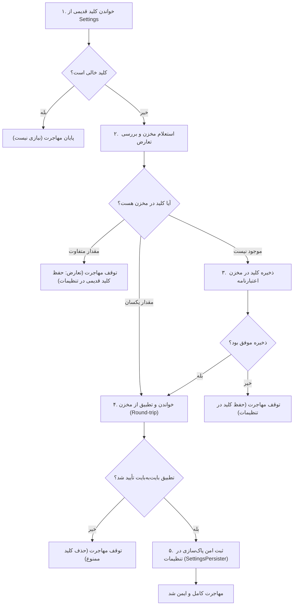
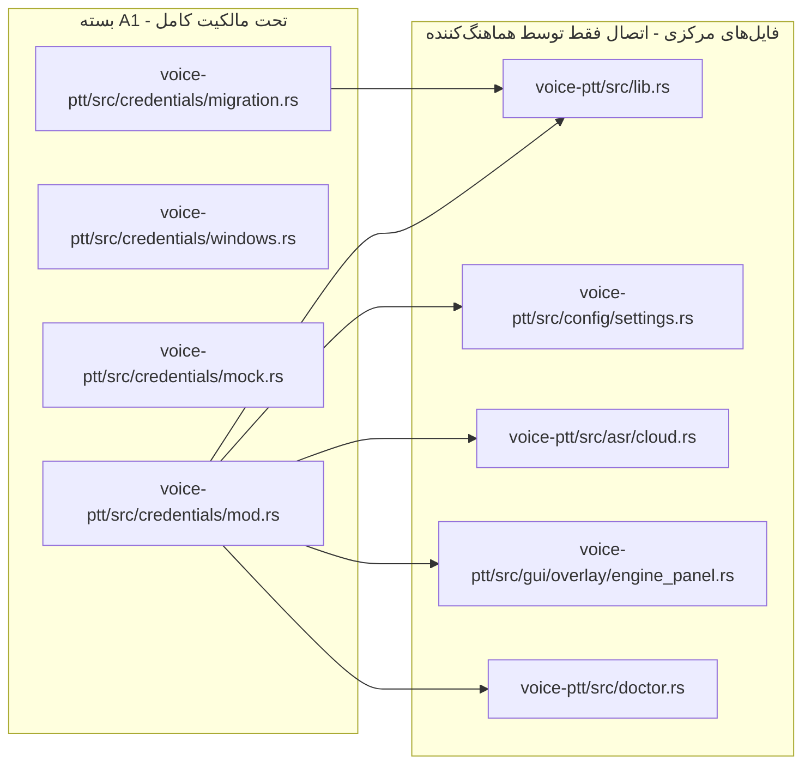

# طرح اجرایی بستهٔ A1 — مخزن اعتبارنامه و مهاجرت امن کلیدها

**شناسنامه سند:**
- **بسته:** `A1` · **موج:** ۲ · **تاریخ:** ۲۰۲۶-۱۰-۰۴
- **نقش:** طراح بستهٔ A1 در پروژهٔ OmniType
- **وضعیت:** طرح اجرایی نهایی (Execution Design) — آماده برای پیاده‌سازی ایزوله و اتصال نهایی توسط هماهنگ‌کننده
- **مبنای ورودی:** [CONTRACTS.md](CONTRACTS.md) بند ۸، [AGENT-EXECUTION-PLAN.md](../AGENT-EXECUTION-PLAN.md) بستهٔ A1

---

## ۱. وضعیت موجود با ارجاع کد (Baseline Audit)

پیش از هرگونه مداخلهٔ معماری، جریان کامل ورود، نگهداری، خواندن و مصرف کلیدها در کد فعلی ردیابی و مستند شده است:

### ۱.۱. ورود کلید در رابط کاربری و سوءتفاهم «ماسک رابط»
در فرم ثبت ارائه‌دهندهٔ سفارشی ابری در زبانهٔ موتورها ([engine_panel.rs:420-435](../../voice-ptt/src/gui/overlay/engine_panel.rs#L420-L435)):
```rust
rtl_form_row(ui, "کلید API:", 98.0, |ui| {
    ui.add(
        egui::TextEdit::singleline(&mut state.new_key)
            .password(true)
            .hint_text("sk-...")
            .desired_width((field_w - 85.0).max(90.0)),
    );
    let key_status = if state.new_key.trim().is_empty() {
        format_persian_display("وارد نشده")
    } else {
        format_persian_display("ماسک‌شده")
    };
    // ...
});
```
**شاهد و تحلیل فنی:**
1. فراخوانی `.password(true)` در `egui` صرفاً به موتور گرافیکی اعلام می‌کند که نویسه‌ها را با نماد گلوله/ستاره رندر کند.
2. مقدار ورودی مستقیماً به عنوان یک `String` متنی استاندارد و رمزنگاری‌نشده در ساختار `EnginePanelState.new_key` نگهداری می‌شود ([engine_panel.rs:32](../../voice-ptt/src/gui/overlay/engine_panel.rs#L32)).
3. برچسب «ماسک‌شده» در رابط کاربری تنها وضعیت حضور رشته را نشان می‌دهد و **هیچ‌گونه پیوند یا حفاظتی با مخزن امن ندارد**. متغیر در حافظه به صورت متن آشکار باقی می‌ماند.

### ۱.۲. نحوهٔ ذخیره‌سازی کلید روی دیسک (Plaintext Persistence)
هنگام کلیک روی دکمهٔ «ثبت و فعال‌سازی این موتور» در [engine_panel.rs:500-520](../../voice-ptt/src/gui/overlay/engine_panel.rs#L500-L520):
```rust
let provider = CustomProvider {
    id: id.clone(),
    name,
    base_url: url,
    api_key: state.new_key.trim().to_string(),
    model,
    language: lang,
    timeout_secs: 20,
};
// ...
if let Ok(mut s) = settings.write() {
    s.active_engine = id.clone();
    s.add_or_update_provider(provider);
    let _ = s.save(config_path);
}
```
و در [settings.rs:477-481](../../voice-ptt/src/config/settings.rs#L477-L481):
```rust
pub fn save(&self, path: &Path) -> Result<()> {
    let serialized = toml::to_string_pretty(self)?;
    std::fs::write(path, serialized)?;
    Ok(())
}
```
**شاهد و تحلیل فنی:**
کلید در ساختار `CustomProvider` قرار گرفته و به عنوان بخشی از سند پیکربندی بدون هیچ‌گونه رمزنگاری به فرمت TOML تبدیل شده و در فایل متنی `%APPDATA%\voice-ptt\config.toml` نوشته می‌شود. هر کاربر یا فرایندی با دسترسی خواندن به دایرکتوری کاربر می‌تواند کلیدها را بخواند.

> [!WARNING]
> **عدم اتمیک بودن `Settings::save`:** پیاده‌سازی فعلی ذخیره با `std::fs::write` اتمیک نیست و نباید تضمین حفظ فایل قبلی در شکست‌های ناگهانی یا قطع برق معرفی شود. بنابراین، منطق مهاجرت باید از طریق یک درگاه صریح و قابل‌آزمون (`SettingsPersister`) با قرارداد ثبت امن از فایل بتنی و جزئیات دیسک تفکیک شود.

برای موتور ابری پیش‌فرض (`CloudConfig` در [settings.rs:268-285](../../voice-ptt/src/config/settings.rs#L268-L285))، فیلد `pub api_key: String` تعریف شده است. جالب اینکه در رابط تنظیمات ([settings_panel.rs](../../voice-ptt/src/gui/overlay/settings_panel.rs)) فیلد ورودی برای این کلید وجود ندارد و کاربر مجبور است آن را با ویرایش مستقیم فایل `config.toml` تنظیم کند یا از متغیر محیطی بهره ببرد.

### ۱.۳. تقدم واقعی تنظیمات و متغیر محیطی
در بخش مصرف کلید توسط موتور ابری در [asr/cloud.rs:42-49](../../voice-ptt/src/asr/cloud.rs#L42-L49):
```rust
pub fn new(mut config: CloudConfig, usage_path: PathBuf) -> Self {
    if let Ok(key) = std::env::var("VOICE_PTT_CLOUD_KEY") {
        if !key.trim().is_empty() {
            config.api_key = key;
        }
    }
    let resolved_key = config.api_key.trim().to_string();
    // ...
```
و ارزیابی آمادگی در [settings.rs:308-314](../../voice-ptt/src/config/settings.rs#L308-L314) و [asr/plan.rs:123](../../voice-ptt/src/asr/plan.rs#L123):
```rust
pub fn is_configured(&self) -> bool {
    let env_key = std::env::var("VOICE_PTT_CLOUD_KEY")
        .map(|k| !k.trim().is_empty())
        .unwrap_or(false);
    self.enabled && (!self.api_key.trim().is_empty() || env_key)
}
```
**شاهد و تحلیل فنی:**
1. **تقدم قطعی:** متغیر محیطی `VOICE_PTT_CLOUD_KEY` در صورت وجود و غیرخالی بودن، فیلد `config.api_key` را به طور کامل بازنویسی (Override) می‌کند.
2. **استثنای ارائه‌دهندگان سفارشی:** در `CloudEngine::new_custom` ([asr/cloud.rs:75-88](../../voice-ptt/src/asr/cloud.rs#L75-L88))، هیچ متغیر محیطی بررسی نمی‌شود و موتور منحصراً به `provider.api_key` وابسته است.
3. تحویل کلید به سرور در [asr/cloud.rs:214](../../voice-ptt/src/asr/cloud.rs#L214) از طریق `.bearer_auth(&self.resolved_key)` در هدر درخواست HTTP `reqwest` انجام می‌پذیرد.

### ۱.۴. بررسی تشخیصی Doctor و رد شایعهٔ افشای کلید
بررسی مستند کد در [doctor.rs:216-225](../../voice-ptt/src/doctor.rs#L216-L225) و رندر گزارش در [doctor.rs:261](../../voice-ptt/src/doctor.rs#L261):
```rust
fn key_source(settings: &Settings, cloud_key_in_env: bool) -> KeySource {
    if !settings.cloud.api_key.trim().is_empty() {
        KeySource::ConfigFile
    } else if cloud_key_in_env {
        KeySource::Environment
    } else {
        KeySource::Missing
    }
}
```
و رندر گزارش:
```rust
let _ = writeln!(out, "  cloud key from {}", d.cloud_key_source.label());
```
و آزمون محافظ قفل‌شده در [doctor.rs:510-524](../../voice-ptt/src/doctor.rs#L510-L524):
```rust
#[test]
fn no_secret_is_ever_rendered() {
    let mut s = settings();
    s.cloud = CloudConfig {
        enabled: true,
        api_key: "sk-secret-value-12345".into(),
        ..CloudConfig::default()
    };
    let d = diag(&s, &good_hotkeys(), false);
    let text = render(&d);
    assert!(!text.contains("sk-secret-value-12345"), "{text}");
    assert!(
        text.contains("config.toml"),
        "the source is still named: {text}"
    );
}
```
**شاهد و تحلیل فنی:**
همان‌طور که در تصحیح تاریخی [CONTRACTS.md بند ۸](CONTRACTS.md#L359-L372) ثبت شده است:
- ماژول `doctor` **هرگز مقدار کلید را افشا نمی‌کند** و ادعای افشای کلید توسط آن یک اتهام نادرست بوده است.
- خروجی `--doctor` تنها **منبع کلید** را چاپ می‌کند.
- آنچه امروز یک نقص امنیتی است، **ذخیرهٔ متن سادهٔ کلید در `config.toml` روی دیسک** است، نه رفتار `doctor`.

---

## ۲. قرارداد مخزن اعتبارنامه و انواع داده (Contracts & Types)

برای رفع آسیب‌پذیری نگهداری کلید در متن ساده و انطباق با قرارداد K0، ماژول مستقل `credentials` طراحی شده است.

### ۲.۱. امضای نوع‌دار خطاهای مخزن (`CredentialError`)
برای تفکیک دقیق بین «نبود کلید» و «شکست عملیات سیستم‌عامل»:

```rust
use std::fmt;

/// خطاهای حوزهٔ مخزن اعتبارنامه
#[derive(Debug, thiserror::Error)]
pub enum CredentialError {
    /// کلید برای شناسهٔ درخواستی در مخزن وجود ندارد
    #[error("credential not found for target '{0}'")]
    NotFound(String),

    /// دسترسی به مخزن توسط سیستم‌عامل رد شد (عدم دسترسی، قفل سشن)
    #[error("access denied to credential store for target '{0}'")]
    AccessDenied(String),

    /// خطای سطح سیستم‌عامل ویندوز با کد مشخص
    #[error("operating system error {code} for target '{target}': {message}")]
    OsError {
        code: u32,
        target: String,
        message: String,
    },

    /// دادهٔ بازیابی‌شده معتبر نیست (مثلاً UTF-8 خراب)
    #[error("corrupted or invalid payload for target '{0}'")]
    CorruptedData(String),

    /// مخزن اعتبارنامه یا سرویس وابسته در دسترس نیست
    #[error("credential service is unavailable: {0}")]
    Unavailable(String),

    /// تلاش برای ذخیرهٔ کلید خالی غیرمجاز است؛ باید از delete استفاده شود
    #[error("cannot store an empty or whitespace-only secret; use delete instead")]
    EmptySecret,
}
```

### ۲.۲. کپسوله‌سازی کلید محرمانه (`SecretString`)
برای جلوگیری قطعی از نشت تصادفی کلید در لاگ‌ها، پیام‌های خطا، ردیابی خطای سراسری (Panic Backtrace) و قالب‌بندی `Debug`:

```rust
/// محفظهٔ امن برای نگهداری کلید محرمانه در حافظه
#[derive(Clone, PartialEq, Eq)]
pub struct SecretString(String);

impl SecretString {
    pub fn new(secret: impl Into<String>) -> Self {
        Self(secret.into())
    }

    /// دسترسی کنترل‌شده به متن محرمانه تنها در نقطهٔ تحویل نهایی (مانند هدر HTTP)
    pub fn expose_secret(&self) -> &str {
        &self.0
    }

    /// بررسی خالی بودن رشته بدون افشای محتوا
    pub fn is_empty(&self) -> bool {
        self.0.trim().is_empty()
    }
}

// نمایش امن در Debug: هرگز محتوا چاپ نمی‌شود
impl fmt::Debug for SecretString {
    fn fmt(&self, f: &mut fmt::Formatter<'_>) -> fmt::Result {
        f.write_str("[REDACTED_SECRET]")
    }
}

// نمایش امن در Display: هرگز محتوا چاپ نمی‌شود
impl fmt::Display for SecretString {
    fn fmt(&self, f: &mut fmt::Formatter<'_>) -> fmt::Result {
        f.write_str("[REDACTED_SECRET]")
    }
}

// پاک‌سازی با تلاش بهینه (Best-effort) در زمان پایان عمر شیء
impl Drop for SecretString {
    fn drop(&mut self) {
        // بازنویسی بافر جاری با مقدار صفر جهت کاهش ماندگاری در dump حافظه.
        // توجه: این پیاده‌سازی تلاش بهینه است و ادعای تضمین ریشه‌کن شدن تمام نسخه‌های پیشین کلید از حافظه
        // (مانند رونوشت‌های جابه‌جاشده در تخصیص‌های قبلی heap یا swap سیستم‌عامل) را ندارد.
        unsafe {
            let bytes = self.0.as_bytes_mut();
            for b in bytes.iter_mut() {
                std::ptr::write_volatile(b, 0);
            }
        }
    }
}
```

### ۲.۳. تعریف Trait اصلی مخزن اعتبارنامه (`CredentialStore`)
منطبق بر نیازمندی‌های [CONTRACTS.md بند ۸](CONTRACTS.md#L374-L379) با تقویت امضا جهت تفکیک خطا:

```rust
/// واسط مشترک مخزن اعتبارنامه
pub trait CredentialStore: Send + Sync {
    /// ذخیره یا به‌روزرسانی کلید محرمانه برای یک شناسهٔ مشخص
    fn save(&self, target: &str, secret: &str) -> Result<(), CredentialError>;

    /// بارگذاری کلید محرمانه از مخزن
    fn load(&self, target: &str) -> Result<SecretString, CredentialError>;

    /// حذف کلید محرمانه از مخزن
    fn delete(&self, target: &str) -> Result<(), CredentialError>;
}
```

*توضیح انطباق با K0:* قرارداد K0 امضای ساده‌شدهٔ `anyhow::Result` را ثبت کرده بود. با پیاده‌سازی این Trait و تبدیل خطاهای `CredentialError` به `anyhow::Error` در لایهٔ مرزی، هم سازگاری کامل با K0 حفظ می‌شود و هم در منطق داخلی A1، تطبیق دقیق الگو (Pattern Matching) روی `CredentialError::NotFound` میسر خواهد بود.

### ۲.۴. قواعد نام‌گذاری و شناسه‌های پایدار (Target Namespace Schema)
برای جلوگیری از هرگونه تداخل با سایر نرم‌افزارهای سیستم‌عامل یا میان سرویس‌های مختلف OmniType، شناسهٔ `TargetName` در ویندوز دارای الگوی یکتای نام‌گذاری است:

| دامنهٔ کلید | شناسهٔ هدف در Windows Credential Manager (`TargetName`) | فیلد `UserName` |
|---|---|---|
| موتور ابری پیش‌فرض (Groq / OpenAI) | `OmniType:asr:cloud` | `cloud` |
| ارائه‌دهندهٔ سفارشی با شناسهٔ `{id}` | `OmniType:asr:custom:{id}` | `{id}` |
| کلیدهای موقت تست (آزمون‌های سیستمی) | `OmniType:test:ephemeral:{uuid}` | `test_runner` |

**قواعد:**
1. شناسه‌ها بدون حساسیت به حروف کوچک/بزرگ نرمال‌سازی می‌شوند (`to_lowercase()`).
2. کاراکترهای نامعتبر در نام ویندوز پالایش می‌شوند.
3. تغییر نام شناسه به معنای ثبت یک کلید جدید و حذف کلید پیشین خواهد بود.

### ۲.۵. مدیریت مقادیر خالی، تغییر کلید و تفکیک از مهاجرت خودکار
- **مقدار خالی:** اگر کاربر در رابط کاربری مقدار کلید را خالی کند (`trim().is_empty()`)، متد `save` خطای `CredentialError::EmptySecret` بازمی‌گرداند. منطق رابط موظف است در این سناریو به جای `save`، متد `delete` (یا تابع `explicit_delete_credential`) را فراخوانی کند تا رکورد متناظر از مخزن پاک شود.
- **تغییر صریح کلید توسط کاربر (`explicit_update_credential`):** در صورتی که کاربر ارائه‌دهنده را ویرایش یا کلید جدیدی وارد کند، فراخوانی `explicit_update_credential` انجام می‌شود که به صورت صریح و آگاهانه رکورد پیشین در مخزن را بازنویسی (Overwrite) می‌کند.
- **تفکیک از مهاجرت خودکار:** در خط لولهٔ مهاجرت خودکار در استارت‌آپ، بازنویسی کورکورانهٔ رکوردی که از قبل با مقدار متفاوت در مخزن نشسته **ممنوع** است؛ بلکه تعارض (`MigrationError::Conflict`) ثبت و کلید تنظیمات دست‌نخورده حفظ می‌شود.

### ۲.۶. مخزن ساختگی قابل‌آزمون (`MockCredentialStore`)
برای آزمودن تمامی سناریوها، مهاجرت‌ها و شرایط خطا در Unit Testها بدون نیاز به نشست واقعی ویندوز:

```rust
use std::collections::HashMap;
use std::sync::RwLock;

pub struct MockCredentialStore {
    store: RwLock<HashMap<String, String>>,
    /// پرچم شبیه‌سازی خطای دسترسی سیستم‌عامل
    pub simulate_access_denied: RwLock<bool>,
    /// پرچم شبیه‌سازی از کار افتادگی سرویس
    pub simulate_unavailable: RwLock<bool>,
}

impl MockCredentialStore {
    pub fn new() -> Self {
        Self {
            store: RwLock::new(HashMap::new()),
            simulate_access_denied: RwLock::new(false),
            simulate_unavailable: RwLock::new(false),
        }
    }
}

impl CredentialStore for MockCredentialStore {
    fn save(&self, target: &str, secret: &str) -> Result<(), CredentialError> {
        if *self.simulate_access_denied.read().unwrap() {
            return Err(CredentialError::AccessDenied(target.to_string()));
        }
        if *self.simulate_unavailable.read().unwrap() {
            return Err(CredentialError::Unavailable("mock service down".into()));
        }
        if secret.trim().is_empty() {
            return Err(CredentialError::EmptySecret);
        }
        self.store.write().unwrap().insert(target.to_string(), secret.to_string());
        Ok(())
    }

    fn load(&self, target: &str) -> Result<SecretString, CredentialError> {
        if *self.simulate_access_denied.read().unwrap() {
            return Err(CredentialError::AccessDenied(target.to_string()));
        }
        if *self.simulate_unavailable.read().unwrap() {
            return Err(CredentialError::Unavailable("mock service down".into()));
        }
        match self.store.read().unwrap().get(target) {
            Some(s) => Ok(SecretString::new(s.clone())),
            None => Err(CredentialError::NotFound(target.to_string())),
        }
    }

    fn delete(&self, target: &str) -> Result<(), CredentialError> {
        if *self.simulate_access_denied.read().unwrap() {
            return Err(CredentialError::AccessDenied(target.to_string()));
        }
        if *self.simulate_unavailable.read().unwrap() {
            return Err(CredentialError::Unavailable("mock service down".into()));
        }
        let mut map = self.store.write().unwrap();
        if map.remove(target).is_some() {
            Ok(())
        } else {
            Err(CredentialError::NotFound(target.to_string()))
        }
    }
}
```

### ۲.۷. پیاده‌سازی ویندوز با امکانات سیستمی (`WindowsCredentialStore`)
پیاده‌سازی بر بستر توابع Win32 موجود در پلتفرم ویندوز (`Advapi32.dll`):
- `CredWriteW`: ذخیره‌سازی با نوع `CRED_TYPE_GENERIC` و پایداری `CRED_PERSIST_LOCAL_MACHINE` (ماندگاری در ریبوت سیستم تا حذف صریح توسط کاربر).
- `CredReadW`: خواندن رکورد و آزادسازی حافظهٔ بافر ویندوز با `CredFree`.
- `CredDeleteW`: حذف رکورد با تعیین نوع `CRED_TYPE_GENERIC`.
- **نگاشت کدهای خطای ویندوز (`GetLastError`):**
  - کد `1168` (`ERROR_NOT_FOUND`) به `CredentialError::NotFound`.
  - کد `5` (`ERROR_ACCESS_DENIED`) به `CredentialError::AccessDenied`.
  - سایر کدها به `CredentialError::OsError`.

---

## ۳. چرخهٔ مهاجرت مرحله‌ای و مهار شکست‌ها (Migration Lifecycle & Failure Matrix)

هدف اساسی مهاجرت در بستهٔ A1: **انتقال امن و نامحسوس کلیدها از `config.toml` به Windows Credential Manager بدون از دست رفتن داده (Zero Data Loss) و بدون قطع دسترسی کاربر.**

#### ۳.۱. مراحل ترتیبی خط لولهٔ مهاجرت (Strict 5-Step Pipeline)



#### گام ۱: خواندن کلید قدیمی (`Read Legacy Key`)
کلید متنی از فیلد `api_key` در `CloudConfig` یا هریک از `CustomProvider`ها خوانده می‌شود. اگر رشته خالی یا فقط فاصله باشد، وضعیت `MigrationAction::SkippedEmpty` اعلام شده و هیچ رکوردی لمس نمی‌شود.

#### گام ۲: استعلام مخزن و مهار تعارض (`Store Probe & Conflict Detection`)
پیش از هرگونه نوشتن، مخزن با `cred_store.load(&target_name)` استعلام می‌شود:
- اگر کلید یافت نشد (`NotFound`): مهاجرت به گام ۳ می‌رود.
- اگر کلید با **همان مقدار** وجود داشت: به معنای تکرار مهاجرت یا قطعی پس از گام ۴ در اجرای پیشین است؛ مستقیماً به گام ۴ می‌رود بدون نیاز به بازنویسی مجدد (`already_present = true`).
- اگر کلید با **مقدار متفاوتی** وجود داشت: **تعارض قطعی** است. طبق الزامات، **مهاجرت خودکار هرگز کورکورانه بازنویسی نمی‌کند**. خطای `MigrationError::Conflict` گزارش شده و کلید متنی در تنظیمات دست‌نخورده باقی می‌ماند.

#### گام ۳: ذخیره در مخزن اعتبارنامه (`Store to Credential Manager`)
کلید از طریق `cred_store.save(&target_name, &legacy_secret)` ذخیره می‌شود.

#### گام ۴: خواندن بلافاصله و تأیید تطابق (`Read-back Verification`)
مقدار فوراً با `cred_store.load(&target_name)` بازخوانی شده و با مقدار اولیه به صورت بایت‌به‌بایت مقایسه می‌شود.
> [!IMPORTANT]
> **قاعدهٔ آهنین:** پیش از تأیید کامل ذخیره و بازیابی در گام ۴، حذف کلید از تنظیمات متنی تحت هیچ شرایطی مجاز نیست.

#### گام ۵: ثبت امن پاک‌سازی کلید در تنظیمات (`SettingsPersister Port`)
تنها پس از موفقیت قطعی گام ۴، درگاه `persister.persist_cleared_key(&target_name)` فراخوانی می‌شود. این درگاه بر اساس قرارداد ثبت امن تضمین می‌کند که در صورت شکست دیسک، وضعیت قبلی تنظیمات آسیب نبیند و کلید در تنظیمات حذف‌نشده تلقی گردد.

---

### ۳.۲. جدول حالات شکست، قطع ناگهانی برنامه و مدیریت خطاها

| گام و سناریوی وقوع حادثه | دادهٔ باقی‌مانده در مخزن و دیسک | رفتار برنامه در اجرای بعدی | آنچه کاربر مشاهده می‌کند |
|---|---|---|---|
| **شکست گام ۱ (خواندن config)** | فایل `config.toml` نامعتبر است. | بارگذاری تنظیمات با خطای معمول مواجه می‌شود. | پیام خطای معتبر ساختار TOML در شروع برنامه. |
| **تعارض در گام ۲ (رکورد مخزن دارای مقدار متفاوت)** | کلید در `config.toml` و مقدار متناقض در مخزن هر دو بدون تغییر باقی می‌مانند. | برنامه متوقف نمی‌شود؛ با کلید تنظیمات کار می‌کند و گزارش تعارض ثبت می‌شود. بازنویسی خودکار انجام نمی‌شود. | پیام راهنمایی در گزارش تشخیصی/لاگ مبنی بر وجود کلید در مخزن بدون افشای محتوا. |
| **شکست گام ۳ (خطای ذخیره در مخزن)** | کلید در `config.toml` محفوظ است؛ مخزن خالی یا بدون تغییر است. | برنامه با کلید متنی موجود در `config.toml` کار می‌کند و در استارت بعدی مهاجرت را مجدداً امتحان می‌کند. | کارکرد بدون وقفه و شفاف. ثبت لاگ هشدار `warn!` (بدون درج کلید). هیچ قطعی یا اروری به کاربر نشان داده نمی‌شود. |
| **قطع برق/بسته شدن پروسه در حین گام ۳** | کلید در `config.toml` محفوظ است؛ مخزن ناتمام است. | اجرای بعدی کلید متنی را می‌بیند و گام ۳ را مجدداً اجرا (Overwrite) می‌کند. | کارکرد عادی. |
| **شکست گام ۴ (خواندن ناموفق یا عدم تطابق مقدار)** | کلید در `config.toml` محفوظ است؛ در مخزن رکورد نامعتبر نشسته است. | کلید از `config.toml` حذف **نمی‌شود**. در اجرای بعدی با کلید متنی کار می‌کند. | کارکرد بدون وقفه؛ لاگ هشدار داخلی برای هماهنگ‌کننده. |
| **قطع برق/بسته شدن پروسه بین گام ۴ و ۵** | کلید هم در مخزن ویندوز ذخیره شده و هم در `config.toml` باقی مانده است. | در استارت بعدی، گام ۲ تشخیص می‌دهد که کلید در مخزن با همین مقدار هست؛ بازخوانی تأیید و گام ۵ اجرا می‌شود. | کارکرد عادی و مهاجرت در اجرای بعدی خودکار تکمیل می‌شود. |
| **شکست گام ۵ (خطای درگاه SettingsPersister)** | کلید در مخزن ذخیره شده اما هنوز در تنظیمات وجود دارد؛ درگاه خطا برگردانده است. | کلید در تنظیمات حذف‌نشده تلقی می‌شود و در راه‌اندازی بعدی مجدداً مرحلهٔ ثبت تلاش می‌شود. | کارکرد سیستم قطع نمی‌شود. |
| **مهاجرت تکراری (اجرای مجدد روی سیستم مهاجرت‌یافته)** | فیلد `api_key` در `config.toml` خالی است؛ کلید در مخزن است. | گام ۱ تشخیص می‌دهد که کلید متنی وجود ندارد (`SkippedEmpty`). هیچ تلاشی برای ذخیره یا بازنویسی صورت نمی‌گیرد. | عملکرد سریع و بدون هیچ اقدام اضافه. |

---

## ۴. محل‌های اتصال و حداقل تغییرات فایل‌های مرکزی (Integration Points)

طبق اصول معماری پروژه، فایل‌های مرکزی تنها توسط هماهنگ‌کننده ویرایش می‌شوند. طراح بستهٔ A1 تنها نقاط تماس، امضاها و تغییرات مینیمال را ارائه می‌دهد:



### ۴.۱. تغییرات فایل `voice-ptt/src/config/settings.rs`
- **تغییر:** حفظ فیلدهای فعلی برای سازگاری عقب‌رو و افزودن یک متد کمکی جهت استعلام وضعیت:
```rust
impl CloudConfig {
    /// کلید حل‌شده با بررسی متغیر محیطی، مخزن اعتبارنامه و در نهایت فیلد متنی قدیمی
    pub fn resolve_api_key(&self, cred_store: &dyn crate::credentials::CredentialStore) -> Option<crate::credentials::SecretString> {
        // ۱. اولویت نخست: متغیر محیطی
        if let Ok(env_k) = std::env::var("VOICE_PTT_CLOUD_KEY") {
            if !env_k.trim().is_empty() {
                return Some(crate::credentials::SecretString::new(env_k.trim()));
            }
        }
        // ۲. اولویت دوم: مخزن اعتبارنامه
        if let Ok(secret) = cred_store.load("OmniType:asr:cloud") {
            if !secret.is_empty() {
                return Some(secret);
            }
        }
        // ۳. اولویت سوم: تنظیمات قدیمی (در صورتی که هنوز مهاجرت انجام نشده باشد)
        if !self.api_key.trim().is_empty() {
            return Some(crate::credentials::SecretString::new(self.api_key.trim()));
        }
        None
    }
}
```

### ۴.۲. تغییرات فایل `voice-ptt/src/asr/cloud.rs`
- **تغییر:** نگهداری `resolved_key` به عنوان `SecretString` و پذیرش کلید حل‌شده در سازنده:
```rust
pub struct CloudEngine {
    client: Client,
    config: CloudConfig,
    resolved_key: crate::credentials::SecretString,
    // ...
}
```
در متد `transcribe` در خط ۲۱۴:
```rust
let response = self
    .client
    .post(&url)
    .bearer_auth(self.resolved_key.expose_secret())
    .multipart(form)
    .send()
    .map_err(|e| anyhow!("cloud request failed (network): {e}"))?;
```

### ۴.۳. تغییرات فایل `voice-ptt/src/gui/overlay/engine_panel.rs`
- **تغییر ۱ (هنگام ذخیره ارائه‌دهنده جدید):** به جای ریختن کلید در `provider.api_key`، کلید در `CredentialStore` ذخیره شده و فیلد متنی خالی می‌ماند:
```rust
// ذخیره در مخزن امن
let target = format!("OmniType:asr:custom:{}", id);
if let Err(e) = cred_store.save(&target, state.new_key.trim()) {
    state.msg = Some((format_persian_display("خطا در ذخیره امن کلید"), Instant::now()));
    return;
}
// فیلد متنی در config بدون کلید ثبت می‌شود
let provider = CustomProvider {
    id: id.clone(),
    name,
    base_url: url,
    api_key: String::new(), // خالی روی دیسک
    model,
    language: lang,
    timeout_secs: 20,
};
state.new_key.clear(); // پاک‌سازی حافظه فرم UI
```
- **تغییر ۲ (هنگام حذف ارائه‌دهنده در خط ۳۳۳):**
```rust
let target = format!("OmniType:asr:custom:{}", del_id);
let _ = cred_store.delete(&target);
router.remove_engine(&del_id);
```

### ۴.۴. تغییرات فایل `voice-ptt/src/doctor.rs`
- **تغییر:** گسترش نوع `KeySource` جهت پوشش مخزن اعتبارنامه بدون افشای مقدار:
```rust
#[derive(Debug, Clone, Copy, PartialEq, Eq)]
pub enum KeySource {
    CredentialStore,
    ConfigFile,
    Environment,
    Missing,
}

impl KeySource {
    fn label(self) -> &'static str {
        match self {
            KeySource::CredentialStore => "Windows Credential Manager",
            KeySource::ConfigFile => "config.toml (legacy unencrypted)",
            KeySource::Environment => "VOICE_PTT_CLOUD_KEY environment variable",
            KeySource::Missing => "nowhere",
        }
    }
}
```

### ۴.۵. تغییرات فایل `voice-ptt/src/lib.rs`
- **تغییر:** در فاز راه‌اندازی (مابین خواندن تنظیمات و آماده‌سازی موتورها):
```rust
// ایجاد نمونه مخزن ویندوز
let cred_store = Arc::new(credentials::WindowsCredentialStore::new());

// اجرای مهاجرت در صورت وجود کلید متنی قدیمی در تنظیمات
if let Err(e) = credentials::migration::migrate_all(&mut loaded_settings, cred_store.as_ref(), &config_path) {
    tracing::warn!("credential migration encountered non-fatal error: {e}");
}
```

---

## ۵. وابستگی‌ها و تحلیل فنی Cargo (Dependencies)

### ۵.۱. وضعیت فعلی وابستگی‌ها در `Cargo.toml`
پروژه هم‌اکنون از نگارش `windows = "0.58"` بهره می‌برد ([Cargo.toml:58-71](../../voice-ptt/Cargo.toml#L58-L71)) که شامل ماژول‌های پایه، رابط کاربری و امنیت عمومی است:
```toml
windows = { version = "0.58", features = [
    "Win32_Foundation",
    "Win32_UI_Input_KeyboardAndMouse",
    "Win32_UI_WindowsAndMessaging",
    "Win32_System_LibraryLoader",
    "Win32_System_Memory",
    "Win32_System_SystemInformation",
    "Win32_System_Threading",
    "Win32_Security",
    "Win32_Graphics_Dwm",
    "Win32_Graphics_Gdi",
] }
```

### ۵.۲. گزینه‌های فنی برای دسترسی به Windows Credential Manager

| معیار | گزینه ۱: افزودن فیچر به `windows 0.58` (پیشنهادی) | گزینه ۲: کریت جانبی `keyring = "2"` |
|---|---|---|
| **وابستگی جدید** | **صفر (هیچ کریت جدیدی اضافه نمی‌شود)** | افزودن کریت خارجی `keyring` و مشتقات آن |
| **حجم و زمان کامپایل** | بدون تغییر محسوس (تنها فعال‌سازی یک ماژول موجود) | بارگذاری درخت وابستگی‌های `keyring` |
| **هماهنگی با اهداف پروژه** | پروژه بر پایهٔ Win32 خالص برای ویندوز توسعه می‌یابد | انتزاعی و چندسکویی (Cross-platform) که سربار اضافی دارد |
| **کنترل دقیق خطاها** | کدهای مستقیم `GetLastError` (مانند `ERROR_NOT_FOUND`) | خطاهای عمومی و لایه‌بندی‌شده |

**توصیهٔ صریح طراح A1:**
به هماهنگ‌کننده پیشنهاد می‌شود که تنها فیچر `"Win32_Security_Credentials"` را به آرایهٔ `features` کریت `windows` در `Cargo.toml` اضافه نماید. نیازی به تغییر دیگری در Cargo نیست.

---

## ۶. جدول آزمون‌های پذیرش (Acceptance Test Matrix)

تمامی آزمون‌های واحد و رفتاری بر بستر مخزن ساختگی (`MockCredentialStore`) یا آزمون‌های ساختاری خالص طراحی شده‌اند تا هیچ تداخلی با سیستم کاربر ایجاد نشود:

| شناسه آزمون | سناریو و هدف تست | ورودی آزمون | رفتار مورد انتظار | معیار قبولی |
|---|---|---|---|---|
| **A1-T01** | عملیات پایه (CRUD Round-trip) | ذخیره کلید با شناسه `test:key` و مقدار `sk-valid-123` | خواندن همان مقدار، برابری با مقدار اولیه و حذف موفق | مقدار بازگشتی دقیقاً یکسان است؛ `load` پس از `delete` خطای `NotFound` می‌دهد. |
| **A1-T02** | تمایز «کلید موجود نیست» با خطای سیستم | استعلام شناسه‌ای که اصلاً ذخیره نشده | بازگرداندن `CredentialError::NotFound` | نوع خطا صریحاً `NotFound` است، نه خطای ناشناخته یا Panicking. |
| **A1-T03** | مدیریت خطای عدم دسترسی | فعال‌سازی `simulate_access_denied` در Mock | بازگرداندن `CredentialError::AccessDenied` | سیستم خطا را به عنوان دسترسی ردشده دسته‌بندی می‌کند. |
| **A1-T04** | به‌روزرسانی کلید (Key Overwrite) | ذخیره `secret_v1` و سپس ذخیره `secret_v2` روی همان شناسه | بازنویسی بی‌خطای مقدار پیشین | فراخوانی `load` مقدار `secret_v2` را برمی‌گرداند. |
| **A1-T05** | مهار کلید خالی | فراخوانی `save` با رشتهٔ خالی `""` یا `"   "` | رد ذخیره‌سازی با خطای `EmptySecret` | هیچ تغییری در مخزن ایجاد نمی‌شود. |
| **A1-T06** | چرخهٔ مهاجرت موفق | وجود کلید در تنظیمات متنی | انتقال به مخزن، تأیید بازخوانی و خالی شدن تنظیمات متنی | کلید در مخزن هست؛ فیلد `api_key` در `Settings` خالی شده است. |
| **A1-T07** | توقف مهاجرت در شکست بازخوانی | ایجاد خطا در گام بازخوانی گام ۳ | توقف عملیات مهاجرت و **عدم حذف** کلید از `Settings` | کلید متنی در `Settings` دست‌نخورده باقی می‌ماند (Zero Data Loss). |
| **A1-T08** | تکرارپذیری مهاجرت (Idempotency) | اجرای مجدد مهاجرت روی تنظیمی که قبلاً مهاجرت کرده | وضعیت `Skipped` بدون خطا | هیچ رکورد یا فایلی دستکاری نمی‌شود. |
| **A1-T09** | عدم افشای مقدار در فرمت‌بندی | ایجاد `SecretString("super-secret")` و چاپ با `{:?}` و `{}` | متن خروجی حاوی عبارت `[REDACTED_SECRET]` باشد | عدم وجود زیررشتهٔ `"super-secret"` در متن فرمت‌شده. |
| **A1-T10** | رفتار `doctor` پس از مهاجرت | تنظیم `cloud.api_key` به عنوان منبع مخزن | چاپ `cloud key from Windows Credential Manager` | تست‌های `doctor` پاس می‌شوند و مقدار کلید چاپ نمی‌شود. |

### پروتکل آزمون روی مخزن واقعی سیستم‌عامل (برای فاز بعد - اجرا نشود)
برای آزمون یکپارچگی روی ویندوز واقعی (Integration Smoke Test)، ایجنت پیاده‌ساز موظف است:
1. تنها از شناسهٔ موقت با الگوی `OmniType:test:ephemeral:{uuid}` استفاده کند.
2. با پیاده‌سازی گارد RAII (`struct EphemeralCredentialGuard`) تضمین نماید که با خروج از دامنهٔ تست یا حتی در صورت بروز Panic، رکورد متناظر با `CredDeleteW` از Credential Manager ویندوز پاک شود.
3. هیچ کلید کاربری، شناسهٔ دائمی یا رکورد خارج از این نام را لمس نکند.

---

## ۷. معیار پذیرش و موارد نامشخص (Acceptance Criteria & Open Questions)

### ۷.۱. معیارهای خروج و تحویل بستهٔ A1
- [ ] ماژول `credentials/` با تفکیک فایل‌های `mod.rs`, `windows.rs`, `mock.rs`, `migration.rs` کامل و مستقل باشد.
- [ ] تمامی تست‌های ماتریس پذیرش روی مخزن Mock بدون هشدار کامپایلر پاس شوند.
- [ ] هیچ کلیدی در هیچ لاگ، خطا یا متد `Debug` نشت نکند.
- [ ] هیچ کلیدی پیش از تأیید بازیابی از مخزن، از `config.toml` حذف نشود.
- [ ] فایل `A1-handoff.md` با ارائهٔ دقیق امضاها و سناریوها جهت ادغام به هماهنگ‌کننده تحویل گردد.

### ۷.۲. محدودیت‌های شناخته‌شده امنیتی در محیط ویندوز
باید در مستندات و رابط کاربری به کاربر یادآوری شود:
> **محدودیت امنیتی Windows Credential Manager:**
> مخزن اعتبارنامهٔ ویندوز کلیدها را در برابر کاربران دیگر همان سیستم محافظت می‌کند؛ اما تمامی پروسه‌ها و اسکریپت‌هایی که تحت سشن کاربری و هویت جاری اجرا می‌شوند، می‌توانند به اعتبارنامه‌های همان کاربر دسترسی داشته باشند. این یک محدودیت بنیادین در مدل امنیتی ویندوز است و OmniType ادعای غیرواقعی حفاظت در برابر بدافزارهای فعال در همان نشست کاربری را نخواهد داشت.

### ۷.۳. موارد نامشخص برای تصمیم هماهنگ‌کننده
1. **آیا متغیر محیطی برای ارائه‌دهندگان سفارشی نیاز است؟** در وضعیت فعلی فقط Groq دارای متغیر محیطی است. پیشنهاد A1 حفظ این رفتار برای اجتناب از تغییر ناخواستهٔ دامنه است.
2. **زمان‌بندی افزودن فیچر به `Cargo.toml`:** آیا فعال‌سازی فیچر `"Win32_Security_Credentials"` در موج ۲ قبل از شروع کدنویسی انجام می‌شود یا در زمان ادغام I2؟ (طبق روال، توسط هماهنگ‌کننده در I2 متصل خواهد شد).
